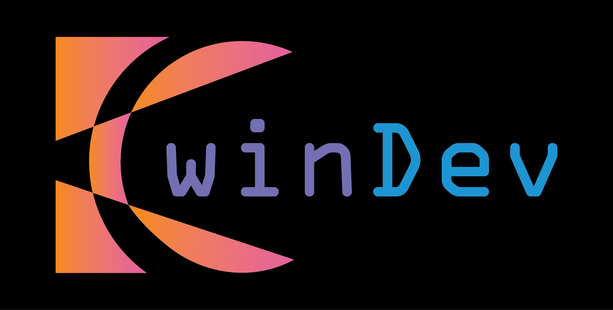

<!-- LOGO / BANNER -->

  <!-- Make sure "owindev.png" (or any image you prefer) is in the same repository folder as this README.md -->
  

<!-- TITLE & SUBTITLE -->
<h1 align="center">Hello, I'm 0win</h1>
<h3 align="center">DAM Student | Aspiring Android Developer</h3>

<!-- SOCIAL BADGES -->

  <!-- GitHub followers -->
  
  
  <!-- Instagram -->
  

  <!-- LinkedIn -->
  

---

## About Me

- 📚 Currently studying **Multiplatform Application Development (DAM)** with a strong passion for **mobile technology**.
- 🎯 Focused on **Android development** using **Kotlin** to build smooth and modern apps.
- 🚀 Exploring **Jetpack Compose**, **Firebase**, and **Kotlin Multiplatform (KMP)** to push my Android skills further.
- 🌱 Always learning and experimenting with new ideas to create engaging user experiences.

---

## Soft Skills

- **Teamwork & Collaboration**  
  Successful software projects are rarely built alone. I strive to communicate openly, give and receive constructive feedback, and celebrate team wins with honesty and humility.

- **Proactivity**  
  I take initiative by proposing ideas, tackling refactors, or introducing new approaches. I’m not afraid to question existing processes if it could lead to improvements.

- **Continuous Learning**  
  The tech world is always evolving. I stay curious, test new tools, and expand my skills to keep up with modern development practices.

- **Self-Management**  
  I organize my own tasks, pick up tickets, and make daily decisions independently. If I see a teammate who needs help or an unattended issue, I jump in without waiting for instructions.

- **Attention to Detail**  
  I believe high-quality code and clear communication can make all the difference. Writing concise documentation, naming variables thoughtfully, and planning a solid structure are vital steps toward robust solutions.

---

## Technologies & Tools

  <!-- Android Studio -->
  

  <!-- Visual Studio -->
  

  <!-- Java -->
  

  <!-- Git -->
  

  <!-- Kotlin -->
  

  <!-- Jetpack Compose (in progress) -->
  

  <!-- Firebase (in progress) -->
  

  <!-- KMP (in progress) -->
  

---

## Featured Projects

<em>Projects coming soon...</em>

<table>
  <tr>
    <td align="center" width="100%">
      <h3>Work in Progress</h3>
      <!-- Replace "./working.png" with your own image file or an external link if you prefer -->
      
      

        I'm currently working on new Android ideas.  
        <strong>Stay tuned for updates!</strong>
      

    </td>
  </tr>
</table>

---

## ⚙️ GitHub Analytics

  

---

## Contact

  <!-- LinkedIn -->
  
  
  <!-- Instagram -->
  

<em>Any suggestions or collaborations are welcome!</em>

