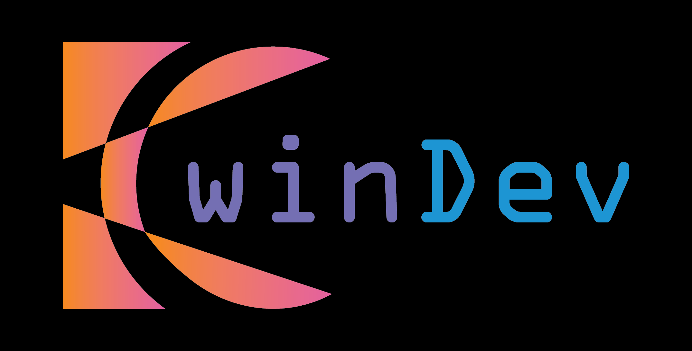

<!-- LOGO / BANNER -->

  

# Hey! I'm 0win 👋

DAM Student | Aspiring Android Developer | Kotlin & Android Enthusiast

I’m passionate about building **modern Android apps** with smooth UX and clean architecture. Currently exploring **Jetpack Compose**, **Firebase**, and **Kotlin Multiplatform (KMP)** while sharpening my skills in **Android development**.

---

## 💻 Currently Learning

- Advanced **Jetpack Compose** patterns  
- **Kotlin Multiplatform** for shared code  
- Modern **app architecture & testing**  
- **Firebase** integrations and cloud features  
- Writing clean, maintainable **Kotlin & Java** code  

---

## 📫 Contact

[LinkedIn](https://www.linkedin.com/in/jairo-rodriguez-blanco/) | [Instagram](https://www.instagram.com/0windev/)

---

## ⚡ Fun Fact

I love **turning ideas into apps**, experimenting with new Android features, and sharing knowledge to help others.
